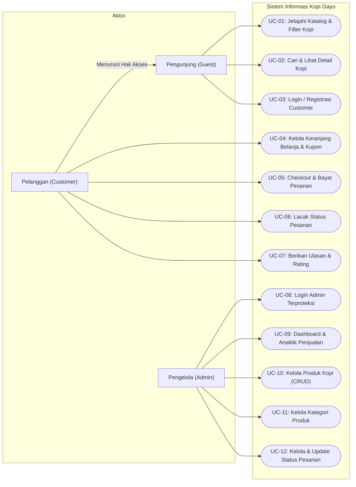
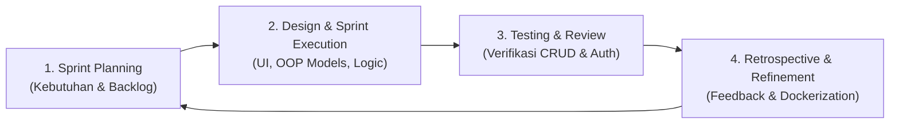
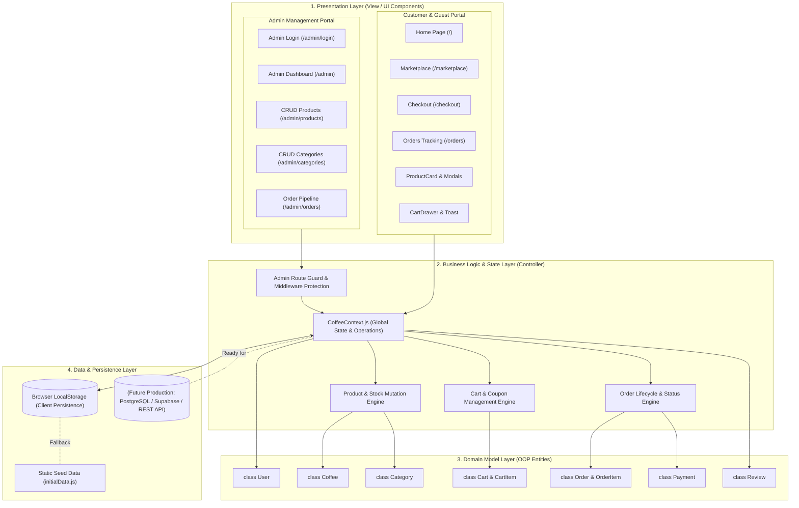

# Belajar-Gt
# TUGAS ANALISIS DAN PERANCANGAN ARSITEKTUR PERANGKAT LUNAK

---

## A. Identitas
- **Nama Aplikasi** : Sistem Informasi Marketplace dan Pemesanan Kopi Gayo Berbasis Web (*Gayo Specialty Coffee Platform*)
- **Nama** : Andre (*Dapat disesuaikan dengan nama lengkap*)
- **NIM** : [Isi NIM Mahasiswa]

---

## B. Deskripsi
Laporan ini memuat analisis kebutuhan, spesifikasi sistem, dan perancangan arsitektur perangkat lunak untuk pembangunan **Sistem Informasi Marketplace dan Pemesanan Kopi Gayo Berbasis Web**. Perancangan ini berfokus pada penerapan metode pengembangan perangkat lunak yang adaptif, arsitektur berbasis komponen (*component-based/layered client-server*), penerapan konsep Pemrograman Berorientasi Objek (*Object-Oriented Programming* / OOP), pemisahan peran yang aman (*role-based separation* antara Admin dan Pelanggan), serta pertimbangan teknis non-fungsional seperti kinerja, keamanan, skalabilitas, dan kemudahan pemeliharaan.

---

## 1. DESKRIPSI SISTEM

### 1.1 Latar Belakang
Dataran Tinggi Gayo (Aceh Tengah, Bener Meriah, dan Gayo Lues) merupakan salah satu sentra penghasil kopi arabika specialty terbaik di dunia dengan indikasi geografis (*Geographical Indication*) yang diakui secara global. Kopi Gayo memiliki karakteristik rasa yang unik berdasarkan varietas, elevasi perkebunan (1.200–1.700 mdpl), serta proses pascapanen seperti *Washed*, *Natural*, *Honey*, hingga *Wine Fermentation*.

Namun, sebagian besar petani, koperasi, dan *roastery* lokal di Gayo masih menghadapi beberapa kendala fundamental:
1. **Rantai Distribusi Panjang**: Petani dan UMKM lokal sering bergantung pada tengkulak dan perantara, sehingga margin keuntungan produsen tertekan sementara harga di konsumen akhir melambung.
2. **Keterbatasan Informasi Produk**: Konsumen penikmat kopi (*coffee enthusiasts*) seringkali kesulitan mendapatkan informasi spesifik mengenai *origin*, profil sangrai (*roasting level*), *cupping notes*, elevasi, dan metode proses dari kopi yang mereka beli.
3. **Pencatatan Penjualan Tradisional**: Proses transaksi, pengecekan inventaris stok biji kopi, pemrosesan pesanan, dan konfirmasi pembayaran di tingkat produsen/penjual masih banyak dilakukan manual melalui aplikasi pesan instan yang rentan kehilangan data (*human error*).

Oleh karena itu, diperlukan sebuah **Sistem Informasi Marketplace dan Pemesanan Kopi Gayo Berbasis Web** yang modern, interaktif, transparan, dan mampu mengintegrasikan etalase pemasaran produk specialty dengan sistem manajemen inventaris dan pemrosesan pesanan secara *real-time*.

### 1.2 Rumusan Masalah
Berdasarkan latar belakang di atas, rumusan masalah dalam pengembangan sistem ini adalah:
1. Bagaimana merancang dan membangun platform marketplace berbasis web yang memfasilitasi transaksi pemesanan kopi specialty Gayo secara langsung dari produsen/penjual ke konsumen?
2. Bagaimana memisahkan hak akses dan fungsionalitas secara aman dan terstruktur antara pelanggan (*Customer Portal*) dan pengelola (*Admin Dashboard*)?
3. Bagaimana mengelola katalog produk kopi (CRUD), inventaris stok, status tahapan pesanan (*order pipeline*), dan kupon promosi secara terintegrasi?
4. Bagaimana merancang arsitektur perangkat lunak yang modular, terukur (*scalable*), serta menerapkan prinsip-prinsip Berorientasi Objek (OOP) agar mudah dikembangkan di masa mendatang?

### 1.3 Tujuan Sistem
Tujuan dari perancangan dan pembangunan sistem ini adalah:
1. Menyediakan platform e-commerce khusus kopi Gayo yang memudahkan konsumen menjelajahi katalog kopi berdasarkan *origin*, tingkat sangrai, proses pengolahan, dan profil rasa.
2. Mengembangkan antarmuka pemesanan yang responsif dengan fitur keranjang belanja interaktif, pemilihan varian gilingan (*grind size*) dan ukuran kemasan, aplikasi kupon diskon, serta simulasi checkout dan pembayaran (QRIS, Virtual Account).
3. Membangun panel administrasi terproteksi (*Admin Panel*) dengan kapabilitas CRUD lengkap untuk produk dan kategori, pelacakan pesanan (5 tahap status), serta visualisasi statistik penjualan.
4. Menerapkan arsitektur perangkat lunak yang kokoh dengan prinsip *Separation of Concerns* (SoC), enkapsulasi objek model, dan kesiapan kontainerisasi menggunakan Docker.

### 1.4 Ruang Lingkup
Ruang lingkup sistem ini mencakup:
1. **Pengguna Publik / Tamu (*Guest*)**:
   - Menjelajahi beranda (*landing page*), edukasi kopi Gayo, dan katalog marketplace.
   - Melakukan pencarian (*search*) dan penyaringan (*filter*) produk kopi berdasarkan kategori, proses, dan tingkat sangrai.
   - Pembatasan: Tidak dapat melakukan *checkout* atau melihat riwayat pesanan sebelum melakukan autentikasi (*Guest Protection*).
2. **Pengguna Pelanggan (*Customer*)**:
   - Autentikasi akun pelanggan (Login & Registrasi).
   - Menambahkan produk ke keranjang belanja (*Cart Drawer*), mengatur kuantitas, memilih ukuran gilingan (*Whole Bean*, *Coarse*, *Medium*, *Fine*) dan berat (200g, 500g, 1000g).
   - Menerapkan kupon diskon (misal: `GAYO10`, `GAYOPREMIUM`).
   - Melakukan *checkout* dengan pemilihan ekspedisi (JNE, J&T, SiCepat) dan metode pembayaran.
   - Melacak status pesanan secara *real-time* (*Menunggu Pembayaran*, *Dikonfirmasi*, *Diproses*, *Dikirim*, *Selesai*).
   - Memberikan ulasan dan penilaian bintang (*rating & review*) serta menyimpan produk ke *Wishlist*.
3. **Pengelola / Admin (*Admin Dashboard*)**:
   - Portal login admin terpisah (`/admin/login`) dengan validasi kredensial dan sesi terproteksi.
   - Dashboard analitik: visualisasi total pendapatan, pesanan aktif, jumlah produk, dan pelanggan terdaftar.
   - Manajemen Produk (CRUD): penambahan kopi baru, pengubahan deskripsi & harga, *inline update* stok barang dengan indikator stok kritis (≤ 10), serta penghapusan produk.
   - Manajemen Kategori (CRUD): klasifikasi produk (*Specialty Grade 1*, *Single Origin*, *Wine Process*, *Honey & Natural*, *Espresso Roast*).
   - Manajemen Pesanan: pembaruan status pesanan pelanggan sepanjang rantai distribusi.
   - Laporan Penjualan: ringkasan metrik transaksi dan performa penjualan.

### 1.5 Stakeholder
Pihak-pihak yang terlibat dan berkepentingan terhadap sistem:
1. **Konsumen / Pembeli Kopi (*Coffee Enthusiasts & Cafes*)**: Pengguna akhir yang mencari dan membeli biji kopi Gayo berkualitas tinggi dengan preferensi sangrai dan gilingan spesifik.
2. **Penjual / Pemilik Usaha / Admin Roastery**: Pihak pengelola yang mengunggah katalog produk, memantau persediaan stok, memverifikasi pembayaran, serta memperbarui pengiriman pesanan.
3. **Petani & Koperasi Kopi Gayo**: Pihak penyedia komoditas yang memperoleh akses pasar digital langsung dan transparansi nilai jual hasil panen.
4. **Pengembang Sistem / Software Engineer**: Tim pengembang yang merancang arsitektur, membangun modul frontend/backend, memelihara performa, dan memastikan keandalan sistem.

---

## 2. FAKTA, ASUMSI, DAN BATASAN

### 2.1 Fakta
1. Kopi Gayo memiliki banyak varian proses pascapanen (*Wine*, *Honey*, *Natural*, *Full Washed*) serta elevasi geografis yang memengaruhi profil rasa, sehingga memerlukan atribut data produk yang detail dan spesifik.
2. Konsumen kopi specialty memiliki preferensi kebutuhan bentuk produk yang beragam (biji utuh vs ukuran gilingan tertentu, serta kemasan 200g hingga 1kg).
3. Transaksi e-commerce modern memerlukan konfirmasi pembayaran instan (seperti QRIS dan Virtual Account) serta transparansi pelacakan nomor resi pengiriman.
4. Pengelolaan stok barang yang tidak terintegrasi dengan etalase belanja berisiko memicu *overselling* (pelanggan memesan barang yang sudah habis).

### 2.2 Asumsi
1. Pengguna (baik admin maupun pelanggan) memiliki perangkat komputer atau ponsel pintar yang terhubung ke jaringan internet dengan peramban (*web browser*) modern yang mendukung JavaScript ES6+.
2. Harga produk dasar dihitung untuk kemasan 200g, dengan faktor pengali harga (*multiplier*) otomatis untuk ukuran 500g dan 1.000g.
3. Alur pembayaran pada fase prototipe/pengujian menggunakan mekanisme *mock payment gateway* terintegrasi yang mensimulasikan perubahan status dari *Pending* ke *Paid*.
4. Akun pengelola (*Admin*) bersifat privat dan tidak dapat dibuat sembarangan melalui formulir registrasi publik.

### 2.3 Batasan
1. **Lingkungan Data**: Pada tahap implementasi saat ini, data disimpan menggunakan *state persistence* berbasis `localStorage` dan in-memory context untuk kebutuhan prototipe demonstratif sebelum integrasi penuh ke basis data terpusat (RDBMS/PostgreSQL).
2. **Keterbatasan Ekspedisi**: Perhitungan ongkos kirim menggunakan estimasi flat-rate berdasar kurir pilihan, belum terhubung secara langsung via webhook API ekspedisi berbayar (*third-party logistic API*).
3. **Autentikasi Produksi**: Sesi autentikasi admin diatur melalui penyimpanan sesi lokal 24 jam; migrasi ke JWT (*JSON Web Token*) bertanda tangan kriptografis dengan *HttpOnly cookies* disiapkan untuk tahap deployment produksi skala penuh.
4. **Platform**: Sistem dibangun sebagai aplikasi web responsif (*Responsive Web Application*), belum berbentuk aplikasi mobile native (Android/iOS).

---

## 3. ANALISIS KEBUTUHAN

### 3.1 Identifikasi Aktor/Pengguna
Sistem membedakan aktor ke dalam 3 entitas pengguna:
| No | Aktor | Deskripsi Peran & Hak Akses |
|---|---|---|
| 1 | **Guest (Pengunjung Umum)** | Pengguna yang belum login. Dapat melihat landing page, membaca artikel/edukasi kopi, menjelajahi etalase katalog kopi, dan mencari produk. Akses dibatasi pada proses checkout dan riwayat pesanan. |
| 2 | **Customer (Pelanggan)** | Pengguna terdaftar yang telah login melalui portal auth. Memiliki akses penuh ke keranjang belanja, kupon diskon, proses *checkout*, pelacakan riwayat pesanan pribadi, pemberian ulasan produk, dan daftar favorit (*wishlist*). |
| 3 | **Admin (Pengelola Toko)** | Pengguna terotentikasi tingkat tinggi via `/admin/login`. Memiliki kontrol penuh atas katalog produk (CRUD), penyesuaian stok langsung, pengaturan kategori, manajemen dan pembaruan status seluruh pesanan pelanggan, serta pemantauan data laporan penjualan. |

### 3.2 Kebutuhan Fungsional
Kebutuhan fungsional sistem dikelompokkan berdasarkan modul:

#### A. Modul Autentikasi & Otorisasi
- **FR-AUTH-01**: Sistem harus menyediakan form login dan registrasi khusus pelanggan pada `/auth`.
- **FR-AUTH-02**: Sistem harus menyediakan form login terpisah dan terproteksi khusus pengelola toko pada `/admin/login`.
- **FR-AUTH-03**: Sistem harus memvalidasi kredensial (email dan password) sebelum memberikan akses.
- **FR-AUTH-04**: Sistem harus menerapkan *route protection middleware* yang secara otomatis mengalihkan pengguna non-admin ke halaman login jika mencoba membuka URL `/admin/*`.
- **FR-AUTH-05**: Sistem harus menyediakan fitur *Logout* untuk mengakhiri sesi pengguna.

#### B. Modul Katalog Produk & Pencarian
- **FR-PROD-01**: Sistem harus menampilkan daftar produk kopi Gayo lengkap dengan gambar, asal wilayah (*origin*), proses, tingkat sangrai, elevasi, *flavor notes*, dan harga.
- **FR-PROD-02**: Sistem harus menyediakan fitur pencarian berdasarkan nama kopi, proses, maupun daerah asal.
- **FR-PROD-03**: Sistem harus menyediakan filter produk berdasarkan kategori (*Specialty*, *Single Origin*, *Wine*, *Honey*, dll).
- **FR-PROD-04**: Sistem harus menampilkan modal detail produk lengkap dengan kalkulator harga dinamis berdasarkan berat kemasan (200g, 500g, 1000g).

#### C. Modul Transaksi & Keranjang Belanja
- **FR-TRX-01**: Sistem harus memungkinkan pelanggan menambahkan produk ke keranjang belanja dengan preferensi jenis gilingan (*grind size*) dan ukuran berat.
- **FR-TRX-02**: Sistem harus dapat memperbarui kuantitas atau menghapus item dari keranjang belanja secara *real-time*.
- **FR-TRX-03**: Sistem harus mendukung penerapan kupon diskon yang valid (misal: potongan 10% atau 15%) dan memotong total belanja secara otomatis.
- **FR-TRX-04**: Sistem harus membatasi aksi *checkout* bagi tamu (*Guest*) dengan menampilkan modal *GuestPrompt*.
- **FR-TRX-05**: Sistem harus memproses transaksi pesanan baru, mengurangi stok produk terkait secara otomatis, serta menghasilkan ID Pesanan dan nomor resi pelacakan.
- **FR-TRX-06**: Sistem harus menyediakan antarmuka pelacakan status pesanan pelanggan (*Menunggu Pembayaran* s.d. *Selesai*).

#### D. Modul Manajemen Admin (CRUD & Monitoring)
- **FR-ADM-01**: Admin dapat melihat ringkasan statistik (total pendapatan, pesanan, total produk, pelanggan).
- **FR-ADM-02 (Create)**: Admin dapat menambahkan produk kopi baru lengkap dengan spesifikasi teknis kopi dan gambar.
- **FR-ADM-03 (Read)**: Admin dapat meninjau tabel inventaris produk beserta indikator stok aman/kritis.
- **FR-ADM-04 (Update)**: Admin dapat mengedit data produk atau memperbarui jumlah stok secara langsung (*inline editing*).
- **FR-ADM-05 (Delete)**: Admin dapat menghapus produk dari etalase dengan modal konfirmasi proteksi data.
- **FR-ADM-06**: Admin dapat mengelola kategori kopi (tambah, edit, hapus).
- **FR-ADM-07**: Admin dapat mengubah tahapan status pesanan pelanggan sepanjang alur pemrosesan.

### 3.3 Kebutuhan Non-Fungsional
| Parameter Kualitas | Spesifikasi & Tolok Ukur Teknis |
|---|---|
| **Performance** | Halaman awal harus memiliki waktu muat (*Initial Load Time*) kurang dari 1.5 detik berkat pemanfaatan server-side/static rendering Next.js. Pembaruan keranjang belanja dan formulir CRUD merespons secara instan (< 100ms) tanpa reload penuh (*Single Page Application experience*). |
| **Security** | Pemisahan rute ketat (*Role-Based Access Control*), validasi input pada sisi klien dan proteksi rute admin layout (`useEffect` & middleware redirection). Mencegah manipulasi peran tanpa login ulang. |
| **Availability** | Sistem dirancang siap di-*deploy* dalam *container* Docker dengan ketersediaan target waktu operasional (*uptime*) mencapai 99.5%. |
| **Scalability** | Arsitektur modular berbasis komponen (*React Components*) dan *Context Provider* memudahkan migrasi dari penyimpanan lokal ke REST API backend atau GraphQL database microservices tanpa merombak total struktur UI. |
| **Maintainability** | Struktur kode mematuhi standar Next.js App Router, pemisahan entitas model OOP di `src/models/types.js`, pemusatan state di `CoffeeContext.js`, serta komponen UI atomik yang bersih dan terdokumentasi. |
| **Reliability** | Sinkronisasi data terpusat (*Single Source of Truth*) memastikan perubahan stok oleh admin langsung terefleksi pada tampilan katalog pelanggan dan memvalidasi stok sebelum checkout guna mencegah inkonsistensi data. |
| **Usability** | Desain mengusung antarmuka modern dengan estetika *Glassmorphism*, palet warna tematik (Burgundy `#9f1239` untuk otoritas Admin dan Amber/Emas `#f59e0b` untuk kehangatan kopi Customer), responsif di layar ponsel, tablet, maupun desktop. |

### 3.4 Use Case

#### Use Case Diagram
Berikut representasi Use Case Diagram sistem:

#### Deskripsi Use Case untuk Proses Utama

##### 1. Use Case: Melakukan Pemesanan Kopi (Customer Checkout)
- **Use Case ID**: UC-05
- **Aktor**: Pelanggan (*Customer*)
- **Deskripsi**: Pelanggan memilih varian gilingan, memasukkan produk ke keranjang, memasukkan kupon, melengkapi alamat pengiriman, memilih ekspedisi dan metode pembayaran, lalu membuat pesanan.
- **Pre-kondisi**: Pelanggan telah login ke dalam sistem dan memiliki minimal satu item produk di keranjang belanja.
- **Skenario Utama**:
  1. Pelanggan membuka keranjang belanja (*Cart Drawer*).
  2. Pelanggan memasukkan kode promo (opsional, misal `GAYO10`) dan sistem menghitung potongan harga.
  3. Pelanggan menekan tombol "Lanjut ke Pembayaran" menuju halaman `/checkout`.
  4. Pelanggan mengisi alamat pengiriman dan memilih kurir ekspedisi (JNE, J&T, SiCepat).
  5. Pelanggan memilih metode pembayaran (QRIS / Bank Virtual Account).
  6. Pelanggan menekan tombol "Bayar Sekarang".
  7. Sistem membuat entitas `Order` baru, mengunci detail item (`OrderItem`), mengurangi stok produk di katalog, dan mengosongkan keranjang belanja.
  8. Sistem mengalihkan pelanggan ke halaman detail pesanan dengan status "Menunggu Pembayaran".
- **Skenario Alternatif**:
  - *Jika pengguna berstatus Guest*: Sistem mencegat proses dan memunculkan modal `GuestPrompt` yang mengarahkan pengguna ke halaman login/register `/auth`.
  - *Jika stok barang tidak mencukupi*: Sistem memunculkan notifikasi error dan meminta pengguna menyesuaikan kuantitas.
- **Post-kondisi**: Pesanan baru tersimpan dengan ID unik, status transaksi aktif, dan stok berkurang.

##### 2. Use Case: Manajemen CRUD Produk Kopi (Admin)
- **Use Case ID**: UC-10
- **Aktor**: Pengelola Toko (*Admin*)
- **Deskripsi**: Admin mengelola katalog barang yang dijual melalui dashboard admin (tambah produk baru, edit detail/harga, perbarui stok secara instan, dan hapus produk).
- **Pre-kondisi**: Admin telah login melalui `/admin/login` dan memiliki sesi admin aktif.
- **Skenario Utama (Create)**:
  1. Admin membuka menu "Produk" pada sidebar admin.
  2. Admin menekan tombol "Tambah Kopi Baru".
  3. Modal formulir muncul; admin menginput nama, kategori, origin, metode proses, tingkat sangrai, deskripsi, harga per 200g, stok, dan URL gambar.
  4. Admin menekan tombol "Tambah ke Katalog".
  5. Sistem memvalidasi input, menginstansiasi objek `Coffee` baru, dan menyimpannya ke koleksi data.
  6. Tabel produk admin dan etalase marketplace customer langsung terbarui seketika.
- **Skenario Utama (Update & Inline Stock)**:
  1. Admin dapat mengklik ikon pensil untuk mengubah informasi menyeluruh, atau langsung mengetikkan angka stok baru pada baris tabel produk.
  2. Sistem memperbarui stok dan memvalidasi apakah kuantitas berada pada kondisi aman (>10) atau kritis (≤10).
- **Skenario Utama (Delete)**:
  1. Admin menekan tombol hapus (ikon sampah).
  2. Sistem menampilkan modal konfirmasi bahaya.
  3. Admin mengonfirmasi; produk dihapus permanen dari etalase pelanggan dan daftar admin.
- **Post-kondisi**: Perubahan katalog tersinkronisasi secara konsisten di seluruh aplikasi.

##### 3. Use Case: Pembaruan Status Pesanan (Admin Order Management)
- **Use Case ID**: UC-12
- **Aktor**: Pengelola Toko (*Admin*)
- **Deskripsi**: Admin memeriksa pesanan yang masuk dan memperbarui status tahapan transaksi pesanan pelanggan.
- **Pre-kondisi**: Terdapat transaksi pemesanan yang dibuat oleh pelanggan.
- **Skenario Utama**:
  1. Admin membuka menu "Pesanan" pada dashboard admin.
  2. Admin memilih nomor pesanan yang ingin diperbarui.
  3. Admin mengubah dropdown status pesanan (*Menunggu Pembayaran* $\rightarrow$ *Dikonfirmasi* $\rightarrow$ *Diproses* $\rightarrow$ *Dikirim* $\rightarrow$ *Selesai*).
  4. Jika status diubah ke *Dikonfirmasi*, status pembayaran otomatis disinkronkan menjadi *Paid*.
  5. Sistem mencatat waktu pembaruan dan memperbarui tampilan pelacakan di portal pelanggan.
- **Post-kondisi**: Status pesanan dan status pembayaran tersinkronisasi secara *real-time*.

---

## 4. PEMILIHAN METODE PENGEMBANGAN

### 4.1 Metode yang Dipilih
Metode pengembangan perangkat lunak yang dipilih untuk proyek ini adalah **Agile Development Method** dengan kerangka kerja **Scrum / Prototyping Terarah**.

### 4.2 Alasan Pemilihan
Pemilihan metode Agile (Scrum/Prototyping) didasarkan pada pertimbangan:
1. **Fleksibilitas terhadap Perubahan Kebutuhan**: Pengembangan aplikasi e-commerce sering kali membutuhkan penyesuaian alur antarmuka pengguna (UI/UX) berdasarkan umpan balik, seperti perbaikan pemisahan alur autentikasi admin dan pelanggan yang awalnya tergabung menjadi terpisah ketat.
2. **Pengembangan Bertahap dan Cepat (*Iterative & Incremental*)**: Modul fungsional dapat dirilis per *sprint* (misal: Sprint 1: Katalog & Keranjang; Sprint 2: Autentikasi Terpisah & Sesi; Sprint 3: Admin CRUD & Order Pipeline; Sprint 4: Kontainerisasi Docker).
3. **Deteksi Dini Terhadap Kesalahan (*Early Risk Mitigation*)**: Integrasi berkelanjutan dan pengujian fungsi per komponen di setiap iterasi mencegah penumpukan *bug* pada akhir proyek.
4. **Kesesuaian dengan Karakteristik Proyek Mahasiswa/Akademik**: Memungkinkan penyelesaian prototipe fungsional (*Minimum Viable Product* / MVP) yang dapat langsung diuji dan didemonstrasikan sebelum melangkah ke pemolesan fitur lanjutan.

### 4.3 Tahapan Pengembangan
Berdasarkan metode Agile/Scrum yang diterapkan:
1. **Tahap 1: Backlog & Requirement Engineering (Perencanaan)**
   - Mendefinisikan *User Stories* untuk masing-masing aktor (Guest, Customer, Admin).
   - Menyusun *Product Backlog* yang mencakup fitur katalog, keranjang belanja, checkout, CRUD admin, dan pelacakan order.
2. **Tahap 2: Sprint 1 – Arsitektur Inti, Desain Entitas OOP, & Katalog UI**
   - Pemodelan *Object-Oriented* (`User`, `Coffee`, `Category`, `CartItem`, dll) pada `src/models/types.js`.
   - Implementasi layout responsif bertema kopi Gayo (*Glassmorphism*).
   - Pembangunan halaman etalase marketplace dengan fitur pencarian dan filter kategori.
3. **Tahap 3: Sprint 2 – State Management Terpusat & Keranjang Belanja**
   - Implementasi `CoffeeContext.js` sebagai pusat logika (*Single Source of Truth*).
   - Pembuatan *CartDrawer*, kalkulasi diskon kupon promo, dan integrasi modal detail kopi.
4. **Tahap 4: Sprint 3 – Autentikasi Terpisah, Route Guard, & Proteksi Guest**
   - Pembuatan rute terpisah `/admin/login` dan `/auth`.
   - Penerapan proteksi rute admin pada layout dan pemblokiran checkout untuk tamu melalui `GuestPrompt`.
   - Penyimpanan sesi pengguna pada `localStorage`.
5. **Tahap 5: Sprint 4 – Admin Dashboard CRUD & Pelacakan Pesanan**
   - Implementasi antarmuka CRUD produk lengkap (*Create*, *Read*, *Update*, *Delete*).
   - Penambahan fitur *inline editing* stok barang dan peringatan stok kritis.
   - Pembangunan alur siklus hidup pesanan (5 tahap status).
6. **Tahap 6: Sprint 5 – Pengujian, Kontainerisasi Docker, & Dokumentasi**
   - Pengujian integrasi antarmuka dan penanganan skenario error (*Testing Scenarios*).
   - Pembuatan `Dockerfile` dan publikasi image ke Docker Hub.
   - Penyusunan dokumentasi teknis dan panduan operasional sistem.

---

## 5. ANALISIS DAN PEMILIHAN SOFTWARE ARCHITECTURE

### 5.1 Arsitektur yang Dipilih
Arsitektur perangkat lunak yang dipilih adalah kombinasi antara **Client-Server Architecture** dan **Component-Based Layered Architecture (Arsitektur Berlapis Berbasis Komponen)** yang dimotori oleh framework Next.js (React). Sistem ini juga menerapkan prinsip desain **Model-View-Controller (MVC) terdistribusi** pada frontend serta **Observer Pattern** melalui React Context API.

### 5.2 Alasan Pemilihan
Keputusan teknis pemilihan arsitektur ini didasarkan pada analisis parameter berikut:

1. **Performance**:
   - Next.js memanfaatkan *Hybrid Rendering* (Server Components untuk rendering statis berkecepatan tinggi dan Client Components untuk interaktivitas dinamis).
   - Pembagian beban kerja UI ke dalam komponen mandiri memastikan browser hanya me-*render* ulang (*re-render*) elemen yang mengalami perubahan status (*state change*).
2. **Scalability**:
   - Pemisahan kode antara *Presentation Layer* (komponen UI), *Application Logic Layer* (`CoffeeContext`), dan *Domain Model Layer* (`types.js`) memudahkan perluasan sistem.
   - Jika di masa mendatang sistem dihubungkan dengan Microservices backend (misal: *Payment Service* atau *Inventory Service* terpisah), lapisan logika aplikasi dapat dialihkan ke panggilan REST/gRPC tanpa merusak hierarki antarmuka.
3. **Security**:
   - Batasan arsitektural antara area publik dan area terproteksi dikontrol pada level *Layout Layer*. Admin layout membungkus seluruh sub-halaman admin dengan mekanisme verifikasi sesi otomatis.
   - Tidak ada kebocoran state atau bypass URL langsung karena setiap rute admin melakukan pengecekan hak akses sebelum komponen utama di-mount ke DOM.
4. **Maintainability**:
   - Komponen bersifat independen dan dapat digunakan kembali (*reusable*), seperti `ProductCard`, `CartDrawer`, `Navbar`, dan `Toast`.
   - Kode mudah dipahami oleh pengembang baru karena mengikuti konvensi baku Next.js App Router.
5. **Reliability & Consistency**:
   - Pola *Single Source of Truth* pada `CoffeeContext` menjamin konsistensi data antara apa yang diubah oleh Admin di dashboard dengan apa yang dilihat oleh Pelanggan di marketplace.
6. **Complexity & Cost**:
   - Memberikan keseimbangan optimal antara fleksibilitas tingkat tinggi tanpa membawa kompleksitas berlebih (*over-engineering*) seperti pada arsitektur Microservices penuh yang membutuhkan infrastruktur orkestrasi rumit (Kubernetes, service mesh).
   - Sangat hemat biaya komputasi dan infrastruktur karena dapat di-host secara efisien di platform modern seperti Vercel, VPS Node.js, atau Docker container mandiri.
7. **Technology Constraints**:
   - Memenuhi kebutuhan perkuliahan Pemrograman Berorientasi Objek / Arsitektur Perangkat Lunak, di mana objek-objek domain memiliki atribut, method internal, dan relasi terdefinisi secara terstruktur.

### 5.3 Diagram Arsitektur

Berikut adalah diagram arsitektur sistem secara menyeluruh:

### 5.4 Penjelasan Komponen
1. **Presentation Layer (Lapisan Presentasi)**:
   - Bertanggung jawab merender antarmuka pengguna berbasis komponen React.
   - Terbagi menjadi dua ruang lingkup terisolasi: **Customer Portal** (menitikberatkan pada keindahan visual, kenyamanan belanja, dan responsivitas) dan **Admin Portal** (menitikberatkan pada kepadatan data, kemudahan input form, tabel interaktif, dan kontrol cepat).
2. **Business Logic & State Layer (Lapisan Logika Bisnis & State)**:
   - Diimplementasikan melalui `CoffeeContext.js` yang bertindak sebagai *Controller* pusat.
   - Mengelola seluruh operasi mutasi data: penambahan ke keranjang, validasi kode kupon, pemotongan stok otomatis saat pesanan dibuat, otentikasi sesi 24 jam untuk admin, dan pembaruan status pesanan.
   - Menggunakan prinsip *Inversion of Control* (IoC) di mana setiap komponen cukup berlangganan ke *Context hook* (`useCoffee()`) tanpa perlu melakukan *prop drilling*.
3. **Domain Model Layer (Lapisan Model Objek OOP)**:
   - Terletak di `src/models/types.js` yang memodelkan entitas bisnis dunia nyata ke dalam kelas-kelas JavaScript ES6 (`User`, `Coffee`, `Category`, `Cart`, `CartItem`, `Order`, `OrderItem`, `Payment`, `Review`).
   - Menerapkan enkapsulasi atribut dan method spesifik, seperti `CartItem.getSubtotal()`, `Cart.getTotalPrice()`, dan relasi agregasi/komposisi (misal: 1 `Order` memiliki 1 `Payment` dan banyak `OrderItem`).
4. **Data & Persistence Layer (Lapisan Penyimpanan Data)**:
   - Pada fase prototipe saat ini, lapisan ini memanfaatkan penyimpanan `localStorage` pada peramban yang disinkronkan secara otomatis saat terjadi mutasi state.
   - Dilengkapi *seed data* (`initialData.js`) sebagai nilai mula (*fallback*) jika penyimpanan kosong.
   - Didesain modular sehingga siap digantikan oleh *Data Access Layer* berbasis HTTP fetch / Axios yang terhubung ke RESTful API / database relasional (PostgreSQL) pada lingkungan produksi.

---

## 6. TECHNOLOGY STACK

### 6.1 Programming Language
- **JavaScript (ECMAScript 2023 / ES6+)**: Digunakan di seluruh lapisan aplikasi (frontend, logika konteks, dan perancangan kelas OOP). Mendukung paradigma *Object-Oriented Programming* (Class, Inheritance, Encapsulation) dan *Functional Programming* (Hooks, Immutability).

### 6.2 Framework
- **Next.js 16.3.8 (App Router)**: Framework React enterprise modern dengan kapabilitas *Server-Side Rendering* (SSR), *Static Site Generation* (SSG), sistem *routing* berbasis direktori (`app/`), dan manajemen *layout* bersarang (*nested layouts*).
- **React 19.2.8**: Library inti untuk rekayasa antarmuka pengguna berbasis komponen modular reaktif.

### 6.3 Database
- **Client-Side Persistence (LocalStorage API)**: Digunakan untuk penyimpanan data lokal secara persisten selama demonstrasi/fase prototipe (menyimpan riwayat produk, pesanan, kupon, dan sesi login pengguna).
- **Rekomendasi Arsitektur Produksi**: **PostgreSQL** / **Supabase** (Database Relasional dengan dukungan ACID untuk integritas data transaksi dan inventaris stok).

### 6.4 API/Communication
- **React Context API & State Events**: Komunikasi in-memory real-time antar komponen aplikasi (*Publish-Subscribe / Observer pattern*).
- **JSON (JavaScript Object Notation)**: Format standar pertukaran dan serialisasi data antar komponen maupun ke media penyimpanan.
- **Next.js API Routes / Server Actions**: Fondasi komunikasi asinkron berbasis protokol HTTP/HTTPS RESTful.

### 6.5 Infrastructure/Deployment
- **Docker**: Kontainerisasi perangkat lunak menggunakan *multi-stage build* untuk memastikan aplikasi dapat dijalankan secara konsisten di lingkungan mana pun.
- **Docker Hub Repository**:
  - Image: `kopi-gayo-frontend:v1.0-UTS`
  - Perintah eksekusi: `docker run -d -p 3000:3000 kopi-gayo-frontend:v1.0-UTS`
- **Docker Compose**: Orkestrasi kontainer terpadu untuk kemudahan deployment lingkungan server dengan satu perintah (`docker compose up -d`).
- **Node.js 20+ Runtime Engine**: Lingkungan eksekusi runtime server JavaScript.

### 6.6 Tools
- **Code Editor / IDE**: Visual Studio Code / Antigravity IDE.
- **Version Control System**: Git & GitHub Repository.
- **UI & Icon Library**: `lucide-react` (koleksi ikon modern yang ringan dan konsisten).
- **Animation Engine**: `framer-motion` (pustaka animasi deklaratif untuk transisi modal, drawer, dan feedback interaksi yang halus).
- **Styling Engine**: **Vanilla CSS** dengan arsitektur variabel CSS kustom (*CSS Variables Tokens*) untuk penerapan tema warna (*Dark Amber* dan *Burgundy*) serta efek *Glassmorphism* tanpa ketergantungan framework CSS pihak ketiga yang berat.

### 6.7 Alasan Pemilihan Teknologi
1. **Next.js & React**:
   - Menghadirkan performa rendering optimal dan arsitektur routing App Router yang mempermudah pemisahan area publik (`/marketplace`), rute terproteksi pelanggan (`/checkout`, `/orders`), serta sub-aplikasi manajemen admin (`/admin/*`).
   - Ekosistem besar, dokumentasi lengkap, dan standar industri pengembangan web modern.
2. **Vanilla CSS dengan Glassmorphism Design Tokens**:
   - Memberikan fleksibilitas penuh terhadap estetika visual tanpa batasan utilitas kaku. Menghasilkan tampilan bertema kopi premium yang memikat (*wow factor*) dengan gradien hangat, efek *blur* kaca, dan kontras tinggi.
3. **Framer Motion**:
   - Meningkatkan pengalaman pengguna (*User Experience*) secara signifikan melalui animasi mikro (*micro-interactions*) pada modal detail, pembukaan keranjang (*drawer slide*), dan notifikasi *toast*, membuat aplikasi terasa responsif dan hidup.
4. **Docker & Kontainerisasi**:
   - Memastikan prinsip "*write once, run anywhere*" terwujud; mengeliminasi masalah perbedaan versi Node.js atau dependensi antar mesin pengembang dan lingkungan evaluasi/pengujian.

---

## 7. KESIMPULAN

Berdasarkan analisis dan perancangan arsitektur perangkat lunak yang telah disusun:
1. **Sistem Informasi Marketplace dan Pemesanan Kopi Gayo Berbasis Web** berhasil dirancang untuk memecahkan kendala pemasaran kopi specialty dengan menyediakan etalase digital komprehensif yang menampilkan detail origin, proses pascapanen, varian gilingan, dan kalkulasi berat dinamis.
2. Pemisahan peran yang tegas antara **Customer Portal** dan **Admin Dashboard** menjamin keamanan data dan integritas hak akses, dilengkapi dengan *route guard* dan sesi terproteksi.
3. Arsitektur berlapis berbasis komponen (*Component-Based Layered Architecture*) yang dipadukan dengan konsep *Object-Oriented Programming* (9 kelas entitas domain) menghasilkan struktur kode yang modular, mudah dipelihara (*maintainable*), dan terukur (*scalable*).
4. Pilihan tumpukan teknologi modern (Next.js, React, Framer Motion, Vanilla CSS Design System, serta kontainerisasi Docker) memastikan sistem memiliki kinerja tinggi, estetika visual premium, dan siap untuk dideploy pada lingkungan produksi maupun pengujian evaluasi akademik.
